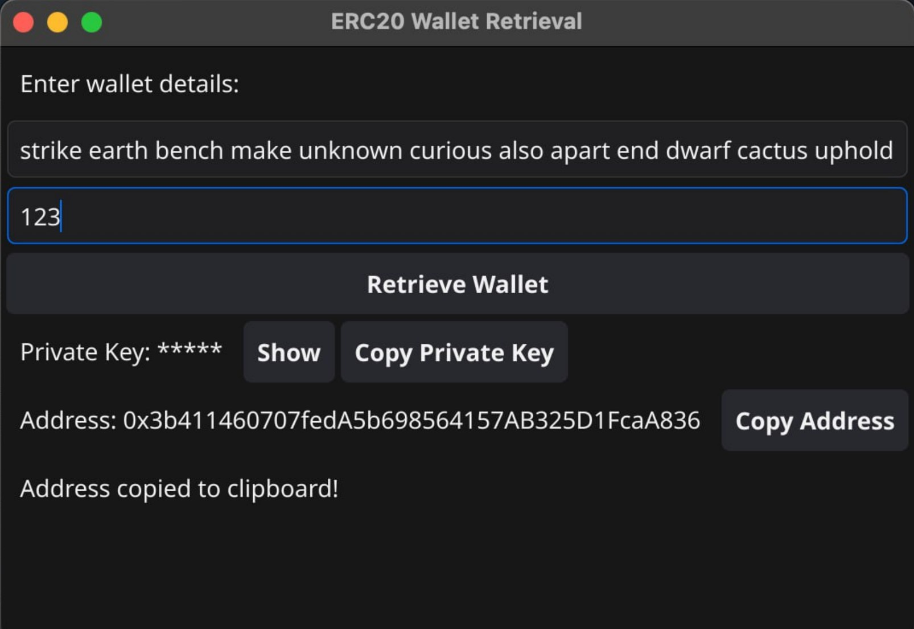

# ERC20 Wallet Retrieval

## Overview

The ERC20 Wallet Retrieval application is a user-friendly tool designed to help users retrieve their Ethereum wallet information using a mnemonic phrase. This application provides a graphical user interface (GUI) that allows users to input their mnemonic and address index to derive their private key and wallet address.

**Security Disclaimer**: Treat your mnemonic phrase and private key with utmost care. Never share them with anyone, as this could lead to the loss of your funds.

## Features

- Input for mnemonic phrase and address index.
- Derivation of private key and wallet address.
- Copy functionality for both private key and wallet address.
- Toggle visibility for the private key to enhance security.

## Screenshots

### Main interface


## Installation

To run this application, ensure you have Go installed on your machine. You can download it from the official Go website: [golang.org](https://golang.org/dl/).

1. Clone the repository:

   ```
   git clone https://github.com/biosfllash/ERC20-wallet-retrieval.git
   ```

2. Navigate to the project directory:

   ```
   cd ERC20-wallet-retrieval
   ```

3. Install the required dependencies:

   ```
   go mod tidy
   ```

## Usage

1. Run the application:

   ```
   go run main.go
   ```

2. Enter your mnemonic phrase in the provided input field.
3. Specify the address index (a number) to derive the corresponding wallet information.
4. Click the "Retrieve Wallet" button to generate the private key and address.
5. Use the "Copy Private Key" and "Copy Address" buttons to copy the respective information to your clipboard.
6. Toggle the visibility of the private key using the "Show" button.

## Testing

To run the unit tests, use the following command:

   ```
   go test ./gui
   ```

## Contributing

Contributions are welcome! If you would like to contribute to this project, please fork the repository and submit a pull request with your changes.

## License

This project is licensed under the MIT License